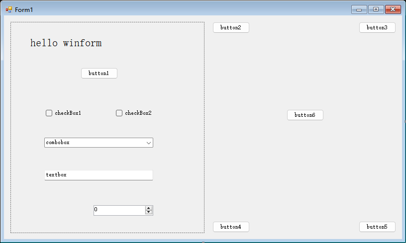
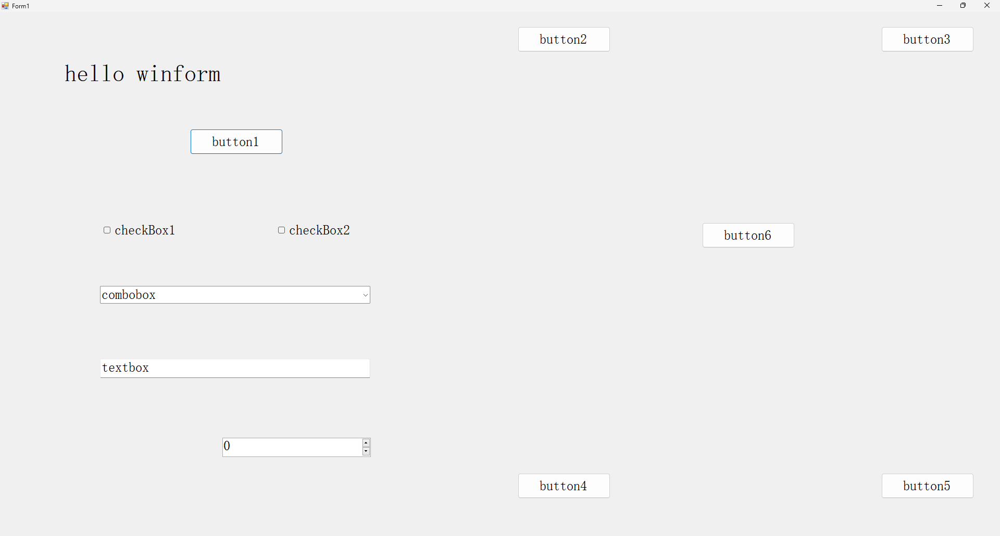

# Winform.AutoSizeHelper

## Introduction
A Control Layout Adaptive Resolution Assistant Class for Winform.  

## Download
- GitHub: https://github.com/hlz2516/Winform.AutoSizeHelper 
- Nuget:  https://www.nuget.org/packages/Winform.AutoSizeHelper 

## Function
- When the container control changes its size, the controls inside the container are arranged adaptively according to their original layout
- When dynamically adding a new control within the container, the size,position and font can be adjusted to fit the layout by calling methods
- If there are nested layouts within the layout, the nested layouts will also be adaptive
- support autosize the listview(only column width)

## How To Use

### Basic Use
1. Design your Form in Form Designer,for example:  


2. Disable the AutoScaleMode property in Form manually.
 Find Form1.Designer.cs and open it, press Ctrl + F to search string:"AutoScaleMode",then you can see this line:
 ```
 this.AutoScaleMode = System.Windows.Forms.AutoScaleMode.Font;
 ```
 Modify it to System.Windows.Forms.AutoScaleMode.None.

3. Create  a AutoSizeHelper and set the container in Form1's constructor
```
using AutoSizeTools;
namespace XXX{
  public partial class Form1 : Form{
    AutoSizeHelper helper;
    public Form1()
    {
        InitializeComponent();
        helper = new AutoSizeHelper();
        helper.SetContainer(this);
    }
  }
}
```

4. Run your application,and maximize the application window,then you can see:


### Dynamically Adding New Controls
if we want to dynamically Add a new button 
which between button2 and button3 by clicking button6,
we can achieve this in the following way:  
1. double click button6 in form deigner,in the following methed,we write code like this:
```
private void button6_Click(object sender, EventArgs e)
{
    Button newBtn = new Button();
    newBtn.Name = "button7";
    newBtn.Location = new Point(568, 12);
    newBtn.Size = new System.Drawing.Size(75, 23);
    newBtn.Text = "button7";
    //apply button6's font to newBtn font
    newBtn.Font = new Font(button6.Font.FontFamily, button6.Font.Size);
    newBtn.UseVisualStyleBackColor = true;
    this.Controls.Add(newBtn);
    helper.AddNewControl(newBtn);
    helper.UpdateControls();
}
```

2. Run the application,click button6,you can see button7 showed between button2 and button3.
then you can maximize or minimize the application window,the button7 always adapt to the current layout.

For more examples, please see github repository.