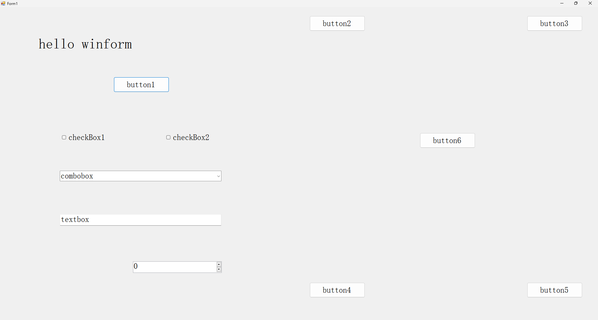

# Winform.AutoSizeHelper

## 介绍
一个适用于Winform的控制布局自适应分辨率辅助类。  

## 下载
- GitHub: https://github.com/hlz2516/Winform.AutoSizeHelper 
- Nuget:  https://www.nuget.org/packages/Winform.AutoSizeHelper   

## 功能
- 当容器控件的大小发生变化时，容器内的控件将根据其原始布局进行自适应排列
- 在容器中动态添加新控件时，可以通过调用方法来调整大小，位置和字体以适应布局
- 如果布局中有嵌套布局，则嵌套布局也将是自适应的
- 支持对listview进行自适应大小改变（仅列宽）

## 如何使用

### 简单使用

1. 在界面设计器中设计窗体界面，比如:  


2. 关闭Form1的AutoScaleMode属性。找到Form1.Designer.cs双击打开，按下ctrl+F查找字符串：“AutoScaleMode”，之后你会看到这行：
```
this.AutoScaleMode = System.Windows.Forms.AutoScaleMode.Font;
```
将System.Windows.Forms.AutoScaleMode.Font改为System.Windows.Forms.AutoScaleMode.None。  
当然，在Form1的设计器界面的属性面板中找到AutoScaleMode属性并设置为None也是可以的。

3. 创建AutoSizeHelper并在Form1的构造函数中设置容器

```
using AutoSizeTools;
namespace XXX{
  public partial class Form1 : Form{
    AutoSizeHelper helper;
    public Form1()
    {
        InitializeComponent();
        helper = new AutoSizeHelper();
        helper.SetContainer(this);
    }
  }
}
```

4. 运行您的应用程序，并最大化应用窗口，然后您可以看到：



### 使用更加完善的AutoSizeHelperEx(推荐)

AutoSizeHelper类只能处理一些简单的情况，对于稍微复杂一点的需求，就轮到更加完善的AutoSizeHelperEx类出场解决了。在演示之前，需要了解一下AutoSizeHelperEx与AutoSizeHelper的不同的一些地方：  
1. AutoSizeHelperEx可以手动调整缩放时字体的缩放比例，而AutoSizeHelper在缩放时不会处理字体大小
2. 声明AutoSizeHelperEx变量的窗体/控件，必须自己绑定SizeChanged事件的处理程序，这样有个好处就是，你可以在处理程序里对不同分辨率屏幕做字体缩放比例的调整；而AutoSizeHelper在调用SetContainer时就自动为SizeChanged事件绑定了一个处理程序，所以使用AutoSizeHelper时用户不需要关心SizeChanged事件，但这样的代价是灵活性降低了

**如何使用AutoSizeHelperEx**

在`简单使用`小节中，我们将第三步的代码改为：
```
using AutoSizeTools;
namespace XXX{
  public partial class Form1 : Form{
    AutoSizeHelperEx helper;
    public Form1()
    {
        InitializeComponent();
        helper = new AutoSizeHelperEx(this);
    }
  }
}
```
接着，我们给Form1添加SizeChanged事件的处理程序。打开Form1的设计器，在属性管理器中，点击事件（闪电logo），找到Sizechanged项，双击它。


转到后台代码，在该事件处理程序中调用更新控件方法，使每次窗体/控件大小发生变化时更新容器内所有子控件。  
```
private void Form1_SizeChanged(object sender, EventArgs e)
{
    helper.UpdateControls();
}
```

### 动态添加新的子控件

如果我们想通过点击按钮6在按钮2和按钮3之间动态添加一个新按钮，我们可以通过以下方式实现:  
1. 在窗体设计器中对button6双击生成对应的处理程序,在该处理程序中,我们这样写:
```
private void button6_Click(object sender, EventArgs e)
{
    Button newBtn = new Button();
    newBtn.Name = "button7";
    newBtn.Location = new Point(568, 12);//这个位置是如何确定的？
    newBtn.Size = new System.Drawing.Size(75, 23);
    newBtn.Text = "button7";
    //apply button6's font to newBtn font
    newBtn.Font = new Font(button6.Font.FontFamily, button6.Font.Size);
    newBtn.UseVisualStyleBackColor = true;
    this.Controls.Add(newBtn);
    helper.AddNewControl(newBtn);
    helper.UpdateControls();
}
```
说明一下，新生成的按钮位置是如何确定的，这个按钮位置是在原设计器中的位置。有个小技巧是，你可以先在设计器界面中拖入一个button，放到你待会儿想要新生成的按钮的位置上，然后把design.cs中生成的对应代码copy到这里来

2. 运行应用程序，单击按钮6，您可以看到按钮7显示在按钮2和按钮3之间。然后您可以最大化或最小化应用窗口，按钮7始终适应当前布局。

更多例子请参考仓库demo，每个例子都是针对特定问题的：
- 我想要在一个主窗体中添加一个子窗体，主窗体和添加进去的子窗体都能自适应缩放，如何做？（多页面框架常见问题，参考add_a_form）
- 在16：9的显示器上，我的字体显示正常，但在4：3的显示器上，我的字体显示超出边界，怎么办？（参考adjust_font）
- 在对窗体应用你的自适应帮助类后，有一部分自定义控件，它们自身大小是改变了，可是它们内部的子控件没有自适应变化，怎么办？（参考scale_usercontrol）

## 重要提示
- 如果按照教程，仍然无法缩放，请检查每个应用了AutoSizeHelper/AutoSizeHelperEx的窗体/控件是否都设置了AutoScaleMode为none
- new AutoSizeHelper/AutoSizeHelperEx这一操作必须跟在InitializeComponent方法之后。如果你想在添加一些控件之后再创建AutoSizeHelper/AutoSizeHelperEx，本类库不保证能正常执行

tips:当前中文版为最新版本，如果您觉得这个类对您有帮助，帮忙点个star让更多人看到，谢谢！