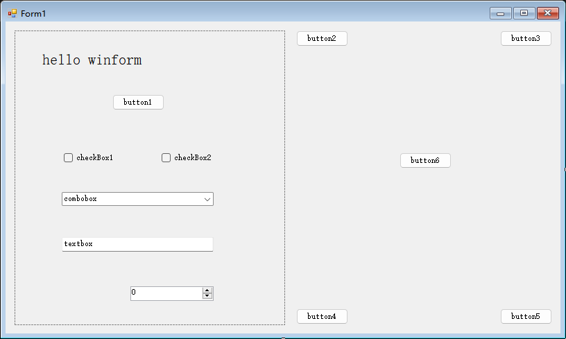

# Winform.AutoSizeHelper

## 介绍
一个适用于Winform的控制布局自适应分辨率辅助类。  

## 下载
- GitHub: https://github.com/hlz2516/Winform.AutoSizeHelper 
- Nuget:  https://www.nuget.org/packages/Winform.AutoSizeHelper   

## 功能
- 当容器控件的大小发生变化时，容器内的控件将根据其原始布局进行自适应排列
- 在容器中动态添加新控件时，可以通过调用方法来调整大小，位置和字体以适应布局
- 如果布局中有嵌套布局，则嵌套布局也将是自适应的

## 如何使用

### 基本使用
1. 在界面设计器中设计窗体界面，比如:  


2. 创建AutoSizeHelper并在Form1的构造函数中设置容器

```
using AutoSizeTools;
namespace XXX{
  public partial class Form1 : Form{
    AutoSizeHelper helper;
    public Form1()
    {
        InitializeComponent();
        helper = new AutoSizeHelper();
        helper.SetContainer(this);
    }
  }
}
```

3. 运行您的应用程序，并最大化应用窗口，然后您可以看到：


### 动态添加新的子控件
如果我们想通过点击按钮6在按钮2和按钮3之间动态添加一个新按钮，我们可以通过以下方式实现:  
1. 在窗体设计器中对button6双击生成对应的处理程序,在该处理程序中,我们这样写:
```
private void button6_Click(object sender, EventArgs e)
{
    Button newBtn = new Button();
    newBtn.Name = "button7";
    newBtn.Location = new Point(568, 12);
    newBtn.Size = new System.Drawing.Size(75, 23);
    newBtn.Text = "button7";
    //apply button6's font to newBtn font
    newBtn.Font = new Font(button6.Font.FontFamily, button6.Font.Size);
    newBtn.UseVisualStyleBackColor = true;
    this.Controls.Add(newBtn);
    helper.AddNewControl(newBtn);
    helper.UpdateControls();
}
```

2. 运行应用程序，单击按钮6，您可以看到按钮7显示在按钮2和按钮3之间。然后您可以最大化或最小化应用窗口，按钮7始终适应当前布局。

tips:中文文档更新可能不及时，最好参考英文版README，如果您觉得这个类对您有帮助，帮忙点个star让更多人看到，谢谢！